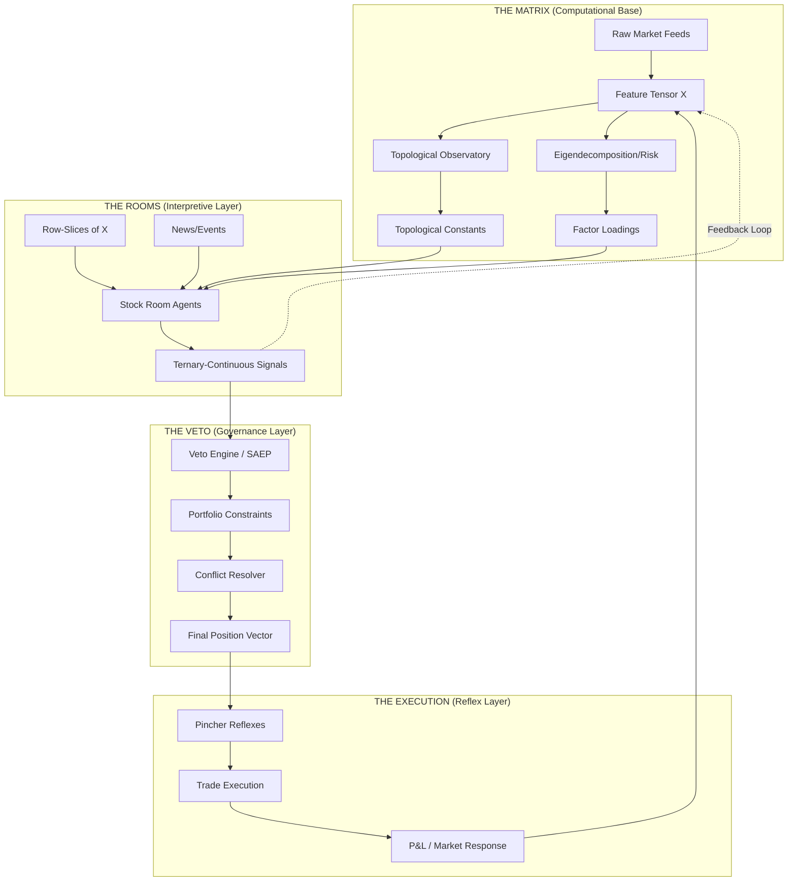

# 🧬 The Hybrid Manifold Architecture

**Status:** Final System Blueprint (Synthesis of Triage & Stress Reports)
**Vision:** Combine the computational efficiency of a Matrix Engine with the interpretive fidelity of Room Agents.

---

## 1. The Core Thesis: Computation $\neq$ Interpretation

The "Hybrid" approach resolve the conflict between O(1) scaling and O(n) fidelity. It recognizes that **computation** is a commodity (low-level, batch-able, uniform), while **interpretation** is a luxury (high-level, idiosyncratic, context-dependent).

We no longer ask an agent to "calculate a Betti number" (waste of LLM tokens, inefficient) or ask a matrix to "interpret an earnings call" (impossible).

### The Division of Labor

| Layer | Mode | Responsibility | Complexity | Input | Output |
|---|---|---|---|---|---|
| **Matrix Engine** | Vectorized | Computational Ground Truth | O(1) | Raw Feeds | $\mathbf{X}_{\text{tensor}}$, $\beta_{\text{curves}}$, $\lambda_{\text{specs}}$ |
| **Room Agents** | Narratological | Idiosyncratic Interpretation | O(n) | Matrix Slices + News | Ternary-Continuous Signals + Story |
| **Veto Engine** | Governance | Portfolio Constraint & Conflict | O(Sekt) | Room Signals | Final Position Vector $\mathbf{P}_t$ |
| **Reflex Engine** | Reactive | High-Symmetry Execution | O(Reflex) | Veto Output | Order Execution |

---

## 2. The Data Flow (The Hybrid Loop)



---

## 3. The Synergistic Feedback Loop

The hybrid system isn't just a pipeline; it's a recursive loop where qualitative interpretation becomes quantitative data.

### The "Narrative-to-Feature" Pipeline
1. **Room Analysis**: A Room Agent discovers that "this stock is now sensitive to lithium prices despite being a tech stock."
2. **Feature Suggestion**: The agent emits a `NEW_FEATURE` baton: `{"feature": "Li_Correlation", "weight": 0.8, "context": "Battery supply chain"}`.
3. **Matrix Integration**: The Matrix Engine creates a new column in the feature tensor $\mathbf{X}$ for "Lithium Correlation" across all stocks.
4. **Topological Update**: The TDA observatory now sees the market through this new dimension, potentially revealing a new symmetry between unrelated stocks.

### The "Topology-to-Narrative" Pipeline
1. **Matrix Detection**: The Matrix Engine detects a $\beta_1$ cycle forming across a cluster of 12 stocks.
2. **Symmetry Alert**: The Matrix broadcasts a `SYMMETRY_CASCADED` event to the 12 affected rooms.
3. **Room Interpretation**: Room Agents receive the alert and search their narratives for the *why*. "Wait, all these stocks have the same ESG-compliance gap — this is a regulatory risk cluster."
4. **Documentation**: The Scribe documents the "Symmetry of Compliance Gap" as a new market regime.

---

## 4. Computational & Memory Budget (n=5000)

| Layer | Memory Cost | CPU/Compute Cost | Bottleneck | Mitigation |
|---|---|---|---|---|
| **Matrix** | ~12GB (FP32 tensor) | High (BPU/GPU) | Memory Bandwidth | Quantization (INT8/FP16) |
| **Rooms** | ~2GB (Shared state) | Low (Async LLM) | API Rate Limits | Batching / Local SLMs |
| **Veto** | ~100MB | Negligible | Logic Complexity | Pre-computed SAEP sets |
| **Reflex** | ~500MB | Low (CPU) | Disk I/O (SQLite) | WAL Checkpointing |

---

## 5. Key Implementation Primitives

### 5.1 The Matrix Interface (`Slices`)
Rooms do not query the matrix blindly. They subscribe to **Slices**:
- `X[my_ticker, :, :]` $\to$ Full temporal history of my features.
- `X[:, feature_i, t]` $\to$ Cross-sectional snapshot (how I compare to the universe).
- `Topol[my_ticker]` $\to$ My current Betti curve and Wasserstein distance to centroid.

### 5.2 The Room Proposal (`Ternary-Continuous`)
Rooms submit their signal as a structured object:
```rust
struct RoomProposal {
    ticker: String,
    gate: Trit,                   // Direction: +1, 0, -1
    weight: f64,                 // Continuous conviction [0.0, 1.0]
    interpretation: String,      // The "Why" (Narrative)
    confidence: f64,             // Reflex confidence
    regime_id: String,           // Current internal regime
}
```

### 5.3 The Veto resolution
The Veto engine applies the **Aggregation Function**:
$$ P_{\text{final}} = \sum_{i \in \text{Rooms}} ( \text{Gate}_i \cdot \text{Weight}_i \cdot \text{Veto}_i ) $$
where $\text{Veto}_i$ is the floating-point scalar $[0, 1]$ produced by the SAEP constraints.

---

## 6. The "Skeptic's" Safeguards

To prevent the "Vectorization Fallacy" (treating launderette data as gold):
1. **Idiosyncratic Override**: Room Agents can flag a signal as `SKEPTICAL`. This forces the Veto engine to ignore the matrix-level consensus and rely on a more conservative, per-stock a-priori safety check.
2. **TDA Validation Gate**: TDA signals are only promoted to the Matrix if they pass the **Randomization Benchmark** (TRIAGE-5).
3. **Symmetry Decay**: Symmetries are not permanent. They are assigned a half-life. If a symmetry alert isn't validated by Room Agents' narratives, the matrix gradually decays the connection weight.

## 7. Next Manifests
- [ ] `HYBRID-API.md`: The gRPC/JSON-RPC spec for the Matrix $\leftrightarrow$ Room interface.
- [ ] `PORTFOLIO-Sizer.md`: The continuous allocation logic for the Veto layer.
- [ ] `Symmetry-Engine.rs`: Rust implementation of the matrix-level symmetry detector.
